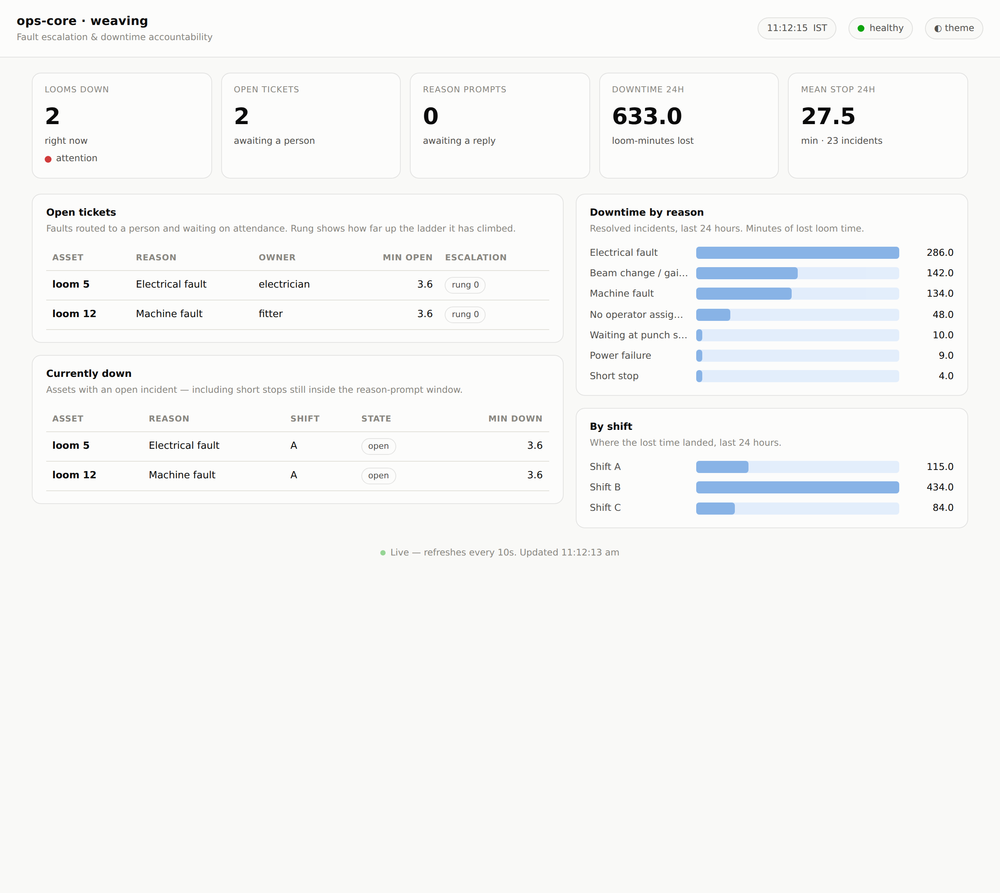

# ops-core

**Fault escalation and downtime accountability for the weaving shed.**
Shingora Textiles Pvt. Ltd, Panchkula — first department: weaving (44 rapier looms).

A loom stops. Today the supervisor posts into a group chat; the message is lost or
unanswered, the loom stays down, and afterwards nobody can establish who was told, when,
or why nothing happened. ops-core removes the three failures that channel has — **no
owner, no clock, no record** — by *removing a human decision* rather than policing one:

- **Routing** maps a reason code → role → the person on duty *now*. Assignment happens
  without anyone choosing.
- **An escalation timer** applies the clock. Silence becomes the escalating act, not the
  safe one.
- **An append-only event log** records every state change with a timestamp and an actor,
  so afterwards nobody has to argue about what happened.

This build is **Phase 1 (Core + WhatsApp reason capture)** on **Flask + MySQL**. It runs
end-to-end today against a bundled mock loom API and a log-based notifier, with real loom
/ WhatsApp / Google Chat integrations dropping in via config and `.env` — no code change.



---

## What's in this build

| Layer | Included (Phase 1) |
|---|---|
| **Sources** (department-specific) | `weaving_loom_api` (the real Loom Data API — cursor-paged `/data`, stop derived from `rpm 0`), `manual` (extension point), a fixture source for replay |
| **Core** (written once, no judgement) | incidents (open/reason/resolve/reopen + grace), classify (min-duration gate, fleet/power/boundary auto-classify), routing (code→role→person, shift-aware), escalation (ladder advance + recurrence override), ticker, outbox (at-least-once + dedupe) |
| **Notifiers** (department-blind) | `log` (default, zero-credential), `whatsapp` (BSP template + numbered quick replies), `gchat` (space/DM cards) |
| **Workers** | poller, ticker, outbox — background daemon threads in one process |
| **HTTP API** | `/health`, `/webhook/whatsapp`, `/webhook/gchat`, and the `/api/*` read endpoints |
| **Dashboard** | single-file live dashboard (KPIs, open tickets, downtime by reason/shift) |
| **Config** | the four weaving YAML files, validated loudly at boot |
| **Tests** | pytest suite + a virtual-clock replay harness (a shift in seconds) |
| **Deploy** | nginx, systemd, NSSM/waitress, phpMyAdmin-importable schema |

**Not in this build** (Phase 2 / later, by request): the ESP32 panels at the loom and
their `/panel/reason` + `/panel/ack` (RFID acknowledgement) endpoints. Because Phase 1
has no acknowledgement *at the asset*, `tickets.attended_at` stays null by design and
response-vs-repair time cannot yet be separated — the schema and API are already shaped
for it. See **Extending** below.

---

## Architecture

```
Sources (dept-specific)        Core (written once, no judgement)      Notifiers (dept-blind)
  weaving_loom_api  ─┐          incidents · classify · routing         whatsapp
  manual            ─┼─ emit ─► escalation · ticker · outbox ─ send ─► gchat
  fixture (replay)  ─┘          + append-only event log                log (default)
```

Everything department-specific collapses into a source adapter that emits
`IncidentOpened` / `IncidentResolved`; the core cannot tell a loom poll from an ERP query
from a human report apart. Adding a second department is four YAML files (and one adapter
only if the resolve signal is genuinely new) — nothing in `core/` changes.

**Storage is MySQL** (the plant's phpMyAdmin database). **Serving is waitress** (pure
Python WSGI) behind nginx. The four reliability rules from the design hold unchanged:
timers are rows (a restart resumes them), every notification carries a unique dedupe key
(at-least-once delivery is safe), exactly one instance runs, and everything is stored in
UTC and rendered IST.

---

## Requirements

- Python 3.10+
- A MySQL / MariaDB database you can reach (this is your phpMyAdmin database)
- `pip install -r requirements.txt` (Flask, PyMySQL, waitress, requests, python-dotenv, PyYAML, pytest)

---

## Quick start (local demo)

```bash
pip install -r requirements.txt

# 1) point .env at your MySQL (copy the template and edit)
cp .env.example .env
#    set OPS_DB_HOST / OPS_DB_PORT / OPS_DB_USER / OPS_DB_PASSWORD / OPS_DB_NAME

# 2) run everything: mock loom API + ops-core + seeded history + two live tickets
python -m scripts.run_demo
#    then open http://127.0.0.1:8000/
```

`run_demo` resets the database, starts the mock loom API and ops-core, seeds a day of
resolved downtime, stops two looms, and posts signed supervisor replies so an
electrician ticket and a fitter ticket open. Outbound messages (the log notifier) are
written to `logs/notifications.log`. Ctrl-C stops it.

The app **creates its own tables on first boot** (it runs the migrations in
`migrations/`). You do not have to import anything by hand — but if you prefer, paste
`deploy/schema.mysql.sql` into the phpMyAdmin **SQL** tab first.

---

## Running it for real

1. **Database.** Create a database (e.g. `ops_core`, charset `utf8mb4`) and a user with
   rights on it. Either let the app create the tables on first start, or import
   `deploy/schema.mysql.sql` via phpMyAdmin. If this database is shared with other apps,
   set `OPS_TABLE_PREFIX` (e.g. `opscore_`) and regenerate the schema with
   `python -m scripts.export_schema`.

2. **Configure `.env`** — MySQL connection, the loom API base URL + key env-var name, and
   (optionally) the WhatsApp BSP / Google Chat credentials. `.env` is never committed.

3. **The loom API is already wired.** `departments/weaving/source.yaml` points at the
   real Loom Data API (`https://cldserver.tailf33eb4.ts.net`); just put the `X-API-Key`
   value in `.env` as `LOOM_API_KEY` (never in config). The adapter streams
   `GET /data?since=<cursor>`, advancing the cursor to each response's `to` and paging
   the backlog when `truncated` is true, reduces each poll to the latest row per machine,
   and derives **stopped from `rpm == 0`** — the API has no status field. The loom
   `machine` number maps to an asset_ref via `asset_ref_prefix` (`93` → `loom_93`). Set
   `LOOM_API_BASE_URL` only to override the base (e.g. to point at the bundled mock).

4. **Start it.** `python -m app.main` (waitress serves on `OPS_HOST:OPS_PORT`, default
   `127.0.0.1:8000`; workers start automatically). Put nginx in front for TLS + auth
   (see `deploy/nginx.conf`) and install it as a service (`deploy/ops-core.service` or
   `deploy/install-service.ps1`).

---

## The lifecycle

1. The **poller** diffs loom state each cycle; a loom crossing into STOPPED opens an
   **incident**.
2. **classify** runs: a fleet-wide stop within a few seconds → *power failure*; a
   fleet-wide stop at a shift boundary → *changeover / punch-station queue*; a stop under
   `min_duration_seconds` → *short stop* (decided at resolve). All of these are recorded
   and page nobody. Anything else schedules the **unknown ladder**.
3. The unknown ladder, after `prompt_after_minutes`, sends the supervisor a numbered
   **reason prompt** over WhatsApp (never a group, never free text). No reply →
   re-prompt → escalate to the shift in-charge.
4. A reply sets the reason. If the reason is **ticketable**, a **ticket** opens, routed to
   the owner role → the person on the current shift, and that reason's **escalation
   ladder** starts (owner → supervisor → shift in-charge, on reason-specific timers).
   Three of the same fault on the same loom within the window jumps the ladder
   (**recurrence override**).
5. The loom restarting is the close event. A **grace window** absorbs false restarts (run
   20s, stop again → the *same* incident reopens). Past grace, the incident resolves,
   duration is computed, the ticket closes `asset_resumed`, and pending timers cancel.
6. Every step is appended to the **event log**.

---

## Configuration (`departments/weaving/`)

All domain judgement lives in YAML a Shingora engineer can edit and reload with a
restart — no redeploy by a contractor. The config is **validated loudly at boot**: a typo
like `owner: electricain` crashes the process on start rather than silently routing
nothing to nobody at 3am.

| File | What it holds |
|---|---|
| `reasons.yaml` | reason codes (en/hi labels, `ticketable`, `owner`, `expected_minutes`, cloth-fault subcodes), `auto_classify` rules, `min_duration_seconds` / `prompt_after_minutes` |
| `routing.yaml` | roles → people **per shift** (roles, never names), each person's WhatsApp/Chat/RFID, and the shift calendar (one source of truth for who's on at 3am *and* changeover detection) |
| `escalation.yaml` | ladders per reason + the `default` and `unknown` ladders, `recurrence`, `quiet_hours` |
| `source.yaml` | which adapter, the loom API settings, `resolve_grace_seconds` (false-restart guard), asset discovery |

Reason options shown in the WhatsApp prompt are the codes flagged `show_in_prompt: true`
(kept short on purpose), plus an always-present "Other".

---

## Notifiers

The default **log notifier** writes every outbound message to `logs/notifications.log`
and never fails — so the whole system is exercisable with no credentials. To send for
real, set the relevant `.env` values and the matching channel is used automatically
(routing picks the channel from each person's contact fields):

- **WhatsApp**: `WHATSAPP_BSP_BASE_URL`, `WHATSAPP_BSP_TOKEN` (adjust the request shape in
  `app/notifiers/whatsapp.py` to your BSP). Inbound replies hit `/webhook/whatsapp`,
  HMAC-verified with `WHATSAPP_WEBHOOK_SECRET`.
- **Google Chat**: `GCHAT_WEBHOOK_BASE_URL`; card actions hit `/webhook/gchat`.

---

## HTTP API

| Method | Path | Purpose |
|---|---|---|
| GET | `/health` | liveness, worker heartbeats, outbox depth, last poll (localhost only) |
| POST | `/webhook/whatsapp` | inbound reply → `inbound_raw` (verbatim) → parse → set reason |
| POST | `/webhook/gchat` | Google Chat card action / reply |
| GET | `/api/overview` | dashboard KPIs |
| GET | `/api/tickets/open` | current open tickets |
| GET | `/api/incidents/open` | currently-down assets |
| GET | `/api/downtime` | aggregated by reason / shift / asset (`?since=&until=`) |
| GET | `/api/response-times` | notified→resolved by role (attend is Phase 2) |
| GET | `/api/events/{entity}/{id}` | full audit timeline for one incident/ticket |
| GET | `/api/reasons` | reason catalogue |
| GET | `/` | the dashboard |

Send a signed test reply with `python -m scripts.dev_reply loom_5 1`.

---

## Operations

- **Health**: `GET /health` returns worker heartbeats, outbox queue depth, and last poll
  time; it 503s if a worker heartbeat is stale.
- **Logs**: structured logs to stdout/stderr (captured to `logs/` by the service unit);
  outbound messages to `logs/notifications.log`.
- **Restart procedure**: stop the service, start the service — timers are rows, so an
  in-flight incident resumes its countdown; the dedupe key stops anyone being re-paged.
  Verify boot-start by **rebooting**, not by starting it by hand.
- **Exactly one instance.** Two copies against one database double every notification.
  Run one. (High availability later is leader election + a separate design.)
- **Secrets** live only in `.env` (git-ignored). Config references env-var *names*.
- **Time**: stored UTC, rendered IST. Do not mix — shift boundaries and the punch-station
  pattern both depend on correct local time.

---

## Testing

```bash
python -m pytest -q          # unit + integration: classify, escalation, lifecycle,
                             # false-restart, outbox dedupe/backoff, config fail-loud
python -m tests.replay       # replay a recorded shift through poller+ticker in seconds
```

The replay harness drives a recorded shift (`tests/fixtures/recorded_shift.json`) through
the real poller/ticker/outbox on a virtual clock, so the timer logic is exercised without
waiting hours. Regenerate the fixture with `python -m scripts.gen_fixture`.

---

## Deployment

- `deploy/nginx.conf` — one TLS host; dashboard + API behind basic auth; webhooks
  rate-limited and signature-verified in the app; `/health` localhost-only.
- `deploy/ops-core.service` — systemd (Linux), `Restart=always`, after
  `network-online.target` + `mariadb.service`.
- `deploy/install-service.ps1` — NSSM (Windows), waitress under a service, auto-start.
- `deploy/schema.mysql.sql` — the schema for a manual phpMyAdmin import.

---

## Extending

- **A new notifier** (SMS, Teams…): implement `send(recipient, payload) -> id` and
  register it in `app/notifiers/__init__.py`.
- **A new source / Phase-2 panel**: emit `IncidentOpened` / `IncidentResolved` (or, for a
  panel, POST reason/ack — the panel path converges on the same `core/incidents` code the
  WhatsApp path uses, so there are never two implementations of the lifecycle).
- **A second department**: add `departments/<name>/{reasons,routing,escalation,source}.yaml`
  and, only if its resolve signal is new, one adapter class. Choose the second department
  on the strength of its *resolve* signal, not on who asks loudest — a weak auto-close
  reintroduces the abandoned-ticket problem.

---

## Deviations from the design doc

All small, all documented in the schema and code:

1. **MySQL instead of SQLite** (your requirement). Timestamps are stored as fixed-width
   UTC ISO-8601 strings (`CHAR(25)`) so the timer comparisons stay plain string compares
   and Rule 4 holds without timezone-typed columns; `utf8mb4` throughout for the Hindi
   labels; `condition` and `trigger` (MySQL reserved words) are kept as column names via
   backticks.
2. **Flask + waitress + background threads** instead of FastAPI + async tasks. Same one
   process, same "exactly one instance," simpler at 44 looms.
3. **`escalations.incident_id` + `escalations.action`, and a nullable `ticket_id`** — so
   the pre-ticket "unknown" (ask_reason) ladder and post-ticket rungs are the same table
   and the same ticker path, exactly as the doc describes ("both advance the same way").
4. **`incidents.resolve_due_at`** — the grace-window timer, kept as a row (Rule 1).
5. **`inbound_raw.matched_incident_id`** — a Phase-1 reply answers a prompt on an
   *incident* (the ticket may not exist yet).
6. **`reasons.yaml: fleet_fraction`** — "fleet-wide" needs a count the doc leaves to
   measurement; defaulted to half the active fleet, overridable. Tune with real data.
7. **Stop is derived from the row, not a `status` field** — the real Loom Data API is a
   cursor-paged time-series (`/data`), not a status snapshot. `source.yaml` expresses the
   test as `stop_when: {field: rpm, lt: 40}` / `resolve_when: {field: rpm, gte: 40}`,
   matching the threshold the loom dashboard already uses (`RPM_ON = 40`) — a halted loom
   coasts and idles in the single digits rather than reading a clean zero. A weft or warp
   break (`thread_stop`) counts as a stop regardless of rpm, since production has ceased
   even while the machine turns. A machine that stops appearing in the feed for
   `offline_after_seconds` opens an `OFFLINE` incident, so a dead edge device cannot read
   as a healthy loom. Loom timestamps (server-local, no timezone) are used only as an opaque
   cursor; incident times use ops-core's UTC clock, so nothing untyped enters storage.
   A stop that both starts and ends within one poll interval is below the short-stop
   threshold anyway and is not surfaced — matched to the design's 30s poll cadence.

---

## Handover checklist (design doc §10)

- [x] Health endpoint returning worker heartbeats, last poll time, outbox depth.
- [x] Structured logs to files with a documented location (`logs/`).
- [x] Documented restart procedure, safe because timers are rows (verify by reboot).
- [x] A note on where secrets live and how to rotate them (`.env`, git-ignored).
- [x] Config files in git, the four weaving YAML files documented inline.
- [x] Schema validation on config load, failing loudly at boot.
- [ ] A named person at Shingora who has edited a reason code and restarted the service at
      least once, supervised. *(Do this together before go-live.)*
```
